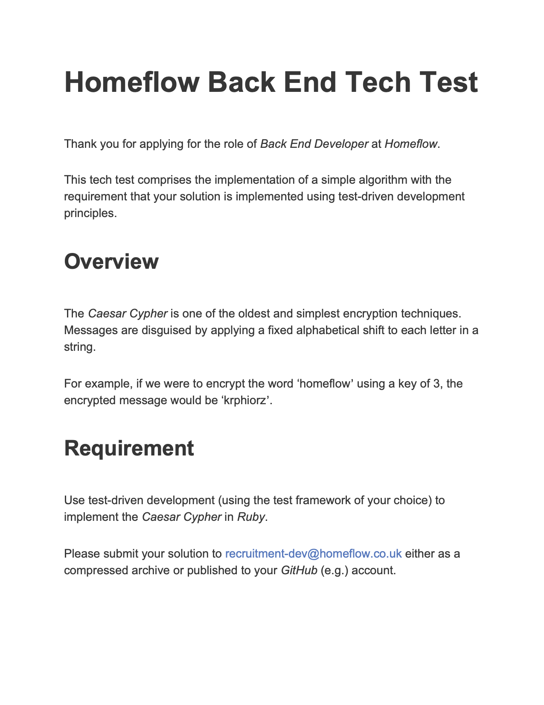
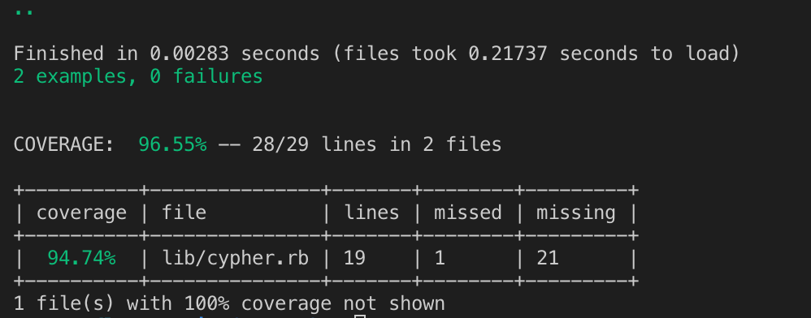

# Ruby tech test for Homeflow

## Using the application 

## A brief overview to how I tackled the tech test

For me it was really important to ensure that I thoroughly stuck to my background using TDD. This helped me to avoid difficult situations where the code was breaking and I didn’t know why. 

Making sure class names and method names were related to their function also made my code much more readable and therefore easier to continue to develop. 

Refactoring is an important part of my process and helped me to mantaine good code quality whilst managing it in smaller chunks that were easier to work with.

## Testing and coverage 
I used Rspec as my testing framework for this tech test. Rspec is the ruby testing framework that I have the most experience in and I'm proud to say that I  have ancheived over 95% test coverage (as seen in the image below). My test coverage was calculated using the Simplecov gem. 

## Potential improvements 
Unfortunately my code currently only works with 1 word parameters, spaces or special characters will cause it to crash. If I were to continue to improve my Caesar Cypher I would make methods that could take out these characters and reinsert them at a later date, using an array to store the information. This was out of the specification at the time so I decided to keep it simple for now.

## Technologies 
 * **ruby 2.6.0p0 (2018-12-25 revision 66547) [x86_64-darwin18]**
 * **RSpec 3.8**
 * **Simplecov** 

## Author 
Harry Galliano
